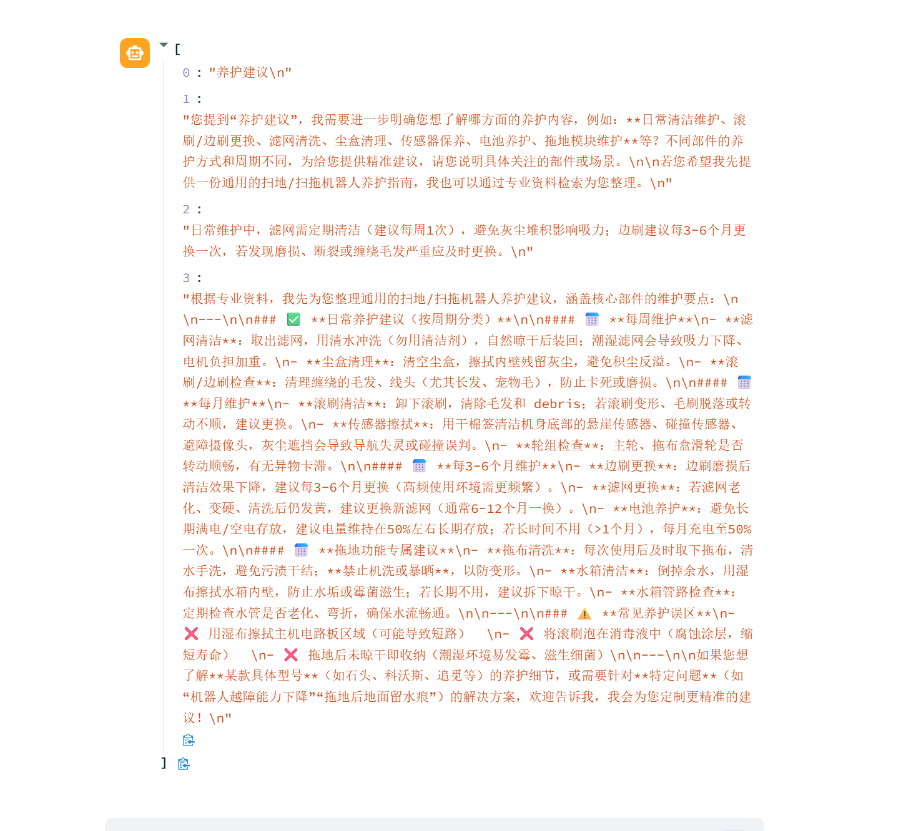

智能家居

docker开启milvus

控制台 streamlit run app.py

log会打印在控制台和txt中

分为内部文件和外部数据。内部：100问，外部：csv用户数据

提示词prompt切换：阅读main_prompt，可以切换到写报告模式 是场景切换 代码在middleware
```
@dynamic_prompt                 # 每一次在生成提示词之前，调用此函数
def report_prompt_switch(request: ModelRequest):     # 动态切换提示词
    is_report = request.runtime.context.get("report", False)
    if is_report:               # 是报告生成场景，返回报告生成提示词内容
        return load_report_prompts()

    return load_system_prompts()
```

模拟问题：
1.我有10万块钱，想放3年，大概能拿多少利息？（调用计算器）
2.手上有5万闲钱，应该怎么配置理财？（问题改写、查询）提示词切换？产品对比？
3.国债是什么，和存钱有什么区别(两个问题，三次资料查询)

qwen3-rerank
qwen3-coder-next
回答格式：



## 📋 项目整体架构与调用流程

这是一个基于 **LangChain + Streamlit** 的智能客服系统，结合了 **RAG（检索增强生成）** 和 **ReAct Agent** 技术。

---

## 🔄 完整调用链路

### **1️⃣ 应用启动阶段**

```
app.py (Streamlit主入口)
    ↓
初始化 ReactAgent
    ↓
加载各种配置和模型
```


**详细流程：**

1. **`app.py`** - 应用入口
   - 启动 Streamlit Web 界面 创建 `ReactAgent` 实例并长时间存储在 session_state 中

2. **`agent/react_agent.py`** - ReactAgent 初始化
   ```
   ReactAgent.__init__()
       ↓
   create_agent() 创建智能体
       ├── model: chat_model (来自 model/factory.py)
       ├── system_prompt: load_system_prompts() (来自 utils/prompt_loader.py)
       ├── tools: 7个工具函数 (来自 agent/tools/agent_tools.py)
       └── middleware: 3个中间件 (来自 agent/tools/middleware.py)
   ```


---

### **2️⃣ 配置加载阶段（模块导入时自动执行）**

```
utils/config_handler.py (模块导入时立即执行)
    ↓
读取4个YAML配置文件
    ├── rag.yml → rag_conf
    ├── chroma.yml → chroma_conf
    ├── prompts.yml → prompts_conf
    └── agent.yml → agent_conf
```


**同时触发：**

```
model/factory.py (模块导入时)
    ↓
创建 chat_model (ChatTongyi - 通义千问)
创建 embed_model (DashScopeEmbeddings - 文本嵌入模型)
```


---

### **3️⃣ 用户交互阶段（核心流程）**

当用户在 Streamlit 界面输入问题时：

```
app.py (第28行)
    ↓
st.session_state["agent"].execute_stream(prompt)
    ↓
agent/react_agent.py - execute_stream()
    ↓
self.agent.stream(input_dict, stream_mode="values", context={"report": False})
    ↓
【LangChain Agent 内部执行循环】
```


---

### **4️⃣ Agent 内部执行流程**

#### **A. 提示词动态切换（每次调用模型前）**

```
middleware.py - report_prompt_switch (@dynamic_prompt)
    ↓
检查 runtime.context["report"] 标志
    ├── False → 返回 load_system_prompts() (普通对话)
    └── True  → 返回 load_report_prompts() (报告生成)
```


#### **B. 日志记录（每次调用模型前）**

```
middleware.py - log_before_model (@before_model)
    ↓
记录即将调用模型的消息数量和内容
```


#### **C. 模型决策是否需要调用工具**

```
chat_model (通义千问)
    ↓
根据用户问题和提示词判断：
    ├── 需要调用工具 → 进入工具执行流程
    └── 直接回答 → 返回最终答案
```


#### **D. 工具执行监控**

```
middleware.py - monitor_tool (@wrap_tool_call)
    ↓
记录工具名称和参数
    ↓
执行具体工具
    ↓
如果调用 fill_context_for_report → 设置 context["report"] = True
```


---

### **5️⃣ 七大工具详解**

#### **工具1：rag_summarize** (RAG知识检索)
```
agent_tools.py - rag_summarize()
    ↓
RagSummarizeService.rag_summarize(query)
    ↓
retriever_docs(query) - 从向量库检索相关文档
    ↓
VectorStoreService.get_retriever().invoke(query)
    ↓
Chroma 向量数据库搜索 Top-K 相似文档
    ↓
构建上下文 context (拼接所有参考文档)
    ↓
load_rag_prompts() - 加载RAG专用提示词
    ↓
PromptTemplate | chat_model | StrOutputParser
    ↓
返回总结后的答案
```


#### **工具2-6：模拟工具**
- `get_weather(city)` - 返回模拟天气数据
- `get_user_location()` - 随机返回城市
- `get_user_id()` - 随机返回用户ID
- `get_current_month()` - 随机返回月份
- `fetch_external_data(user_id, month)` - 从CSV读取外部数据

#### **工具7：fill_context_for_report** (报告生成触发器)
```
agent_tools.py - fill_context_for_report()
    ↓
无实际业务逻辑，仅返回字符串
    ↓
触发 middleware.py 中的 monitor_tool
    ↓
设置 runtime.context["report"] = True
    ↓
下次调用模型时，report_prompt_switch 会切换到报告提示词
```


---

### **6️⃣ 向量知识库初始化（首次使用前需手动运行）**

```
rag/vector_store.py (可独立运行)
    ↓
VectorStoreService.__init__()
    ├── 初始化 Chroma 向量数据库
    └── 初始化文本分割器 RecursiveCharacterTextSplitter
    ↓
load_document() - 加载知识库文档
    ↓
遍历 data/ 目录下的 txt 和 pdf 文件
    ↓
计算每个文件的 MD5 (去重)
    ↓
读取文件内容 (txt_loader / pdf_loader)
    ↓
split_documents() - 分割文本块
    ↓
add_documents() - 向量化并存入 Chroma
    ↓
保存 MD5 到 md5.text (避免重复处理)
```


---

## 🎯 关键设计模式

### **1. 工厂模式**
- `model/factory.py` - ChatModelFactory 和 EmbeddingsFactory

### **2. 单例模式**
- 配置在模块导入时只加载一次
- logger 全局共享

### **3. 中间件模式**
- `@wrap_tool_call` - 工具调用监控
- `@before_model` - 模型调用前日志
- `@dynamic_prompt` - 动态提示词切换

### **4. 服务层封装**
- `RagSummarizeService` - RAG总结服务
- `VectorStoreService` - 向量存储服务

---

## 📊 典型调用场景示例

### **场景1：普通问答**
```
用户："小户型适合哪些扫地机器人？"
    ↓
Agent 决定调用 rag_summarize 工具
    ↓
从 Chroma 检索相关文档
    ↓
用 RAG 提示词让模型总结
    ↓
返回答案给用户
```


### **场景2：生成使用报告**
```
用户："给我生成我的使用报告"
    ↓
Agent 调用 fill_context_for_report()
    ↓
context["report"] = True
    ↓
Agent 继续调用 get_user_id()、get_current_month()、fetch_external_data()
    ↓
收集完数据后再次调用模型
    ↓
report_prompt_switch 检测到 report=True
    ↓
切换到 report_prompt.txt 提示词
    ↓
生成格式化报告
```


---

## 🔧 配置文件依赖关系

```
config/rag.yml → 模型名称配置
config/chroma.yml → 向量库配置
config/prompts.yml → 提示词文件路径
config/agent.yml → 外部数据路径
    ↓
prompts/main_prompt.txt → 主系统提示词
prompts/rag_summarize.txt → RAG总结提示词
prompts/report_prompt.txt → 报告生成提示词
```


---

这就是整个项目的完整调用逻辑！核心是 **Streamlit前端 → ReAct Agent → 工具调用/RAG检索 → 大模型生成** 的流水线架构。